import { YouTube } from '@astro-community/astro-embed-youtube';
import { Card } from '@astrojs/starlight/components';
import { Image } from "astro:assets";

import GitHubCopyingLinkToRelease from "../../../assets/getting-started-assets/github-copying-link-to-release.apng";

<Card title="Obsolete" icon="warning">
    This guide is mostly obsolete, as both the platform and the ui has changed in parts. Additionally, the platform is undergoing overhauls that will simplify much of this guide
    Expect a new comprehensive guide in the future
</Card>

This guide is your starting point for using the Flowcore platform. Whether you're a beginner or an experienced user, it provides insights and tips to help you navigate Flowcore with confidence and make the most of its versatile features.

<div style="display:flex; justify-content:center">
    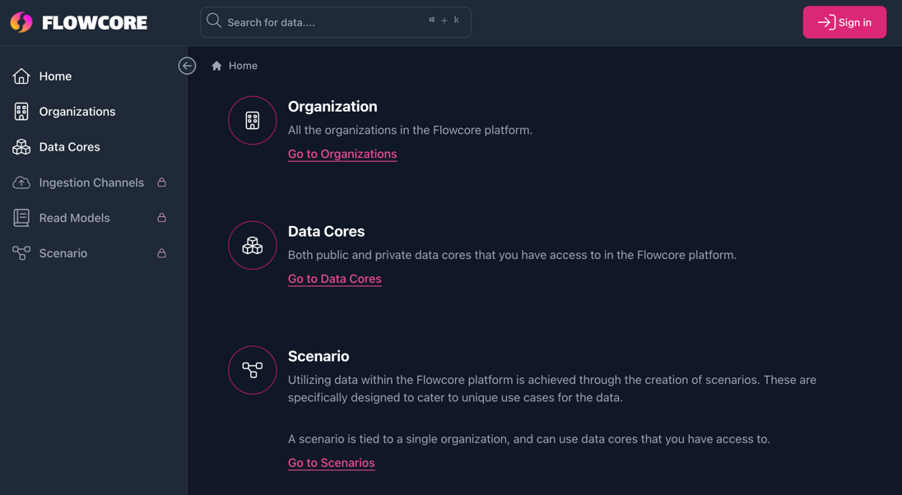
</div>

## Creating an Organization

<YouTube id="https://www.youtube.com/watch?v=5k8OJvOTQ9k" />

Here we will explore how organizations function within the Flowcore platform and how to set up your own organization.

:::note
		**Flowcore is an evolving platform, so keep in mind that certain features may change in the future.** 
:::

**Organizations on Flowcore are publicly accessible**, and users can browse existing organizations to learn more about them, including their:
- Descriptions
- Websites
- Contributors
- and any publicly available data they offer. To get started, you need to log in to Flowcore.

### Login / Creating an account

To log in, go to **www.flowcore.io** and navigate to the top right corner.

<div style="display:flex; justify-content:center">
    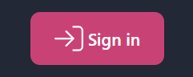 
</div>

Log in using your GitHub account credentials.

<Card title="GitHub" icon="github">
    **If you don't have a GitHub account, you can [click here](/https://docs.github.com/en/get-started/onboarding/getting-started-with-your-github-account/)  if you need a guide on how to set one up.**
</Card>

If you are logging in for the first time, you may encounter a setup page - just leave it do its thing, and press continue once it is done; it is simply there to configure your new account.

<div style="display:flex; justify-content:center">
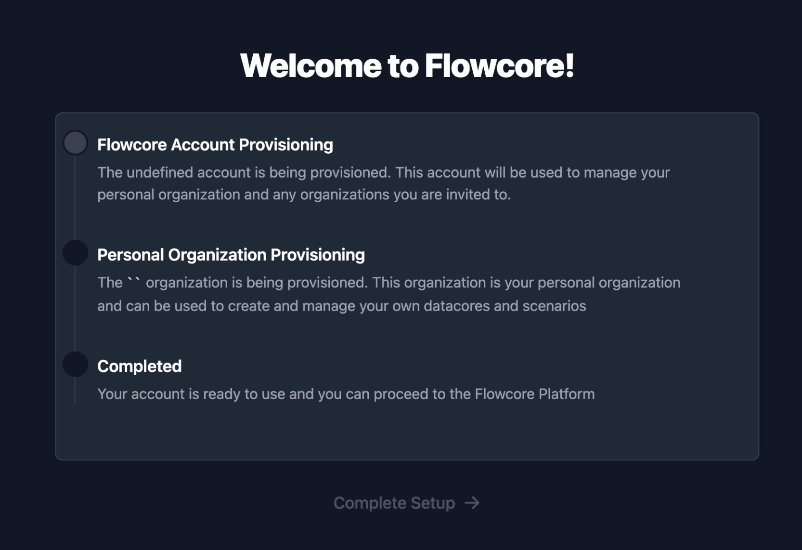 
</div>

After you've logged in, you should see the flowcore dashboard:

<div style="display:flex; justify-content:center">
    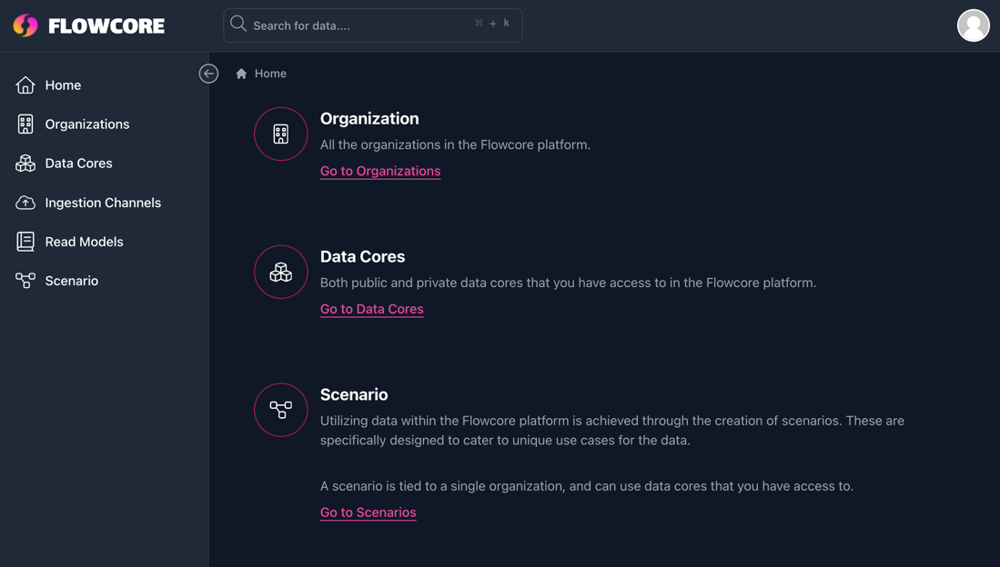
</div>

### Updating your organization

Once logged in, you can navigate to your organizations on the panel on the left-hand side of the page.

<div style="display:flex; justify-content:center">
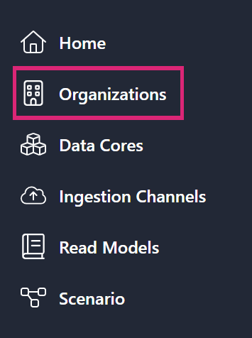 
</div>

Here you will be shown a collection of your organizations, as well as other organizations on the platform. Select your organization:

<div style="display:flex; justify-content:center">
    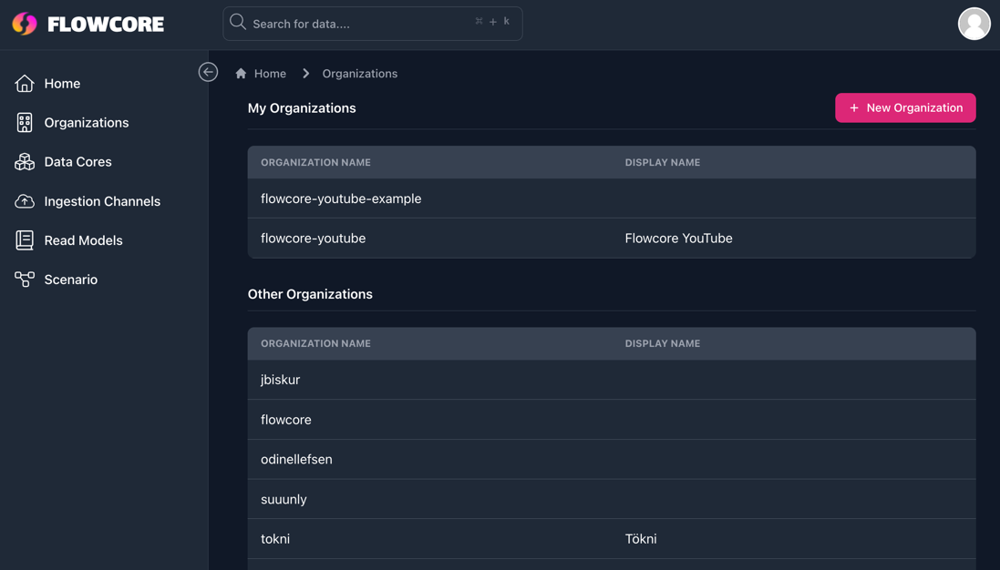
</div>

<div style="display:flex; justify-content:center">
    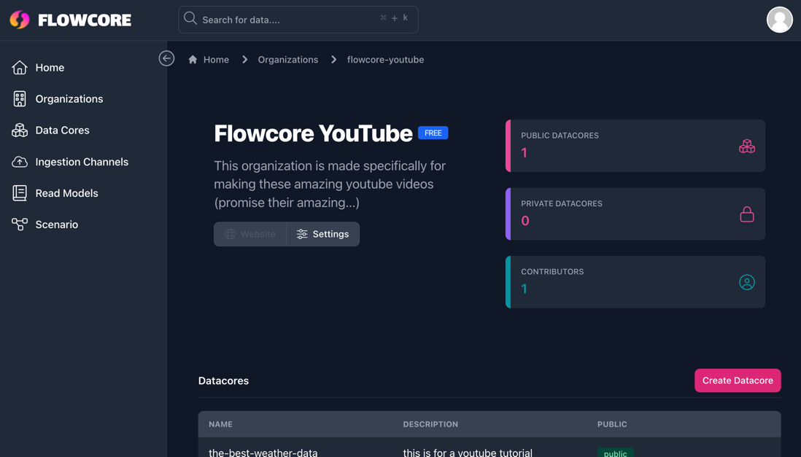
</div>

From here you can customize your organization, by pressing the **Settings** button, allowing you to:
- Set the display name of your organization.
- Provide a brief description of its purpose. 
- Add a link to a website. 

<div style="display:flex; justify-content:center">
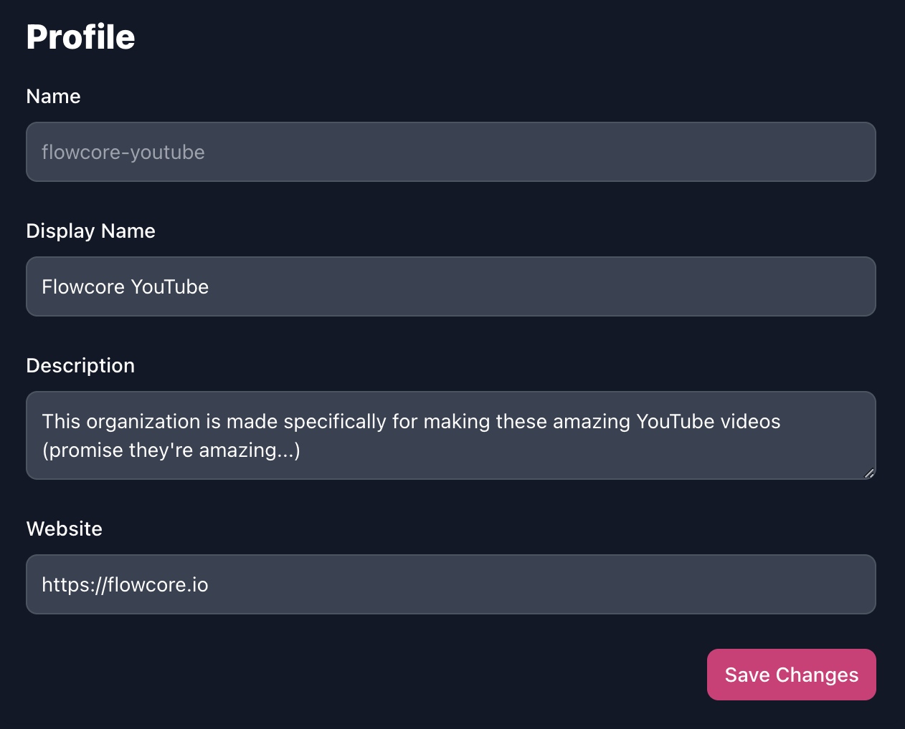 
</div>

### Pricing

Flowcore offers different tiers of service, with varying features and pricing. These plans include:

- **Free Tier:** Suitable for solo users or researchers, who want to explore and share public data.
- **Pro Tier:** Geared towards solo users or companies, providing private Data Cores for exclusive data access.
- **Team Tier:** Ideal for collaborative teams, allowing multiple contributors to participate.
- **Custom Tier:** Tailored for large organizations, offering dedicated support and resources.

<div style="display:flex; justify-content:center">
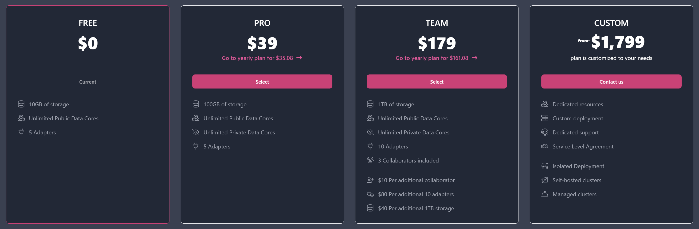 
</div>

Plans can be billed on a **yearly** or **monthly** basis, depending on your preference. 

You can always change your plan by clicking the **Upgrade** button on the bottom right of your organization's page.

<div style="display:flex; justify-content:center">
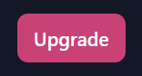 
</div>

By default, when you first log into the Flowcore platform, your organization will be assigned the **Free Tier**. You can choose to upgrade at any point.

### Creating Additional Organizations

It is important to understand the relationship between users and organizations on Flowcore. When you log in, a personal organization is created that matches your username. Your personal organization typically utilises the free or pro tier, for your own personal projects and/or test use cases.

If you want to establish a separate organization for a specific project or team, you can easily create one - **when you create a second organization, you are automatically added to that organization as a collaborator, with the role of *Owner*.**

To create a new organization, simply navigate back to the list of organizations and press the **New Organization** button in the top right corner.

<div style="display:flex; justify-content:center">
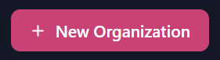 
</div>

## Creating a Data Core

<YouTube id="https://www.youtube.com/watch?v=IdPruN6Zyic" />

Here we will provide an overview of Data Cores, explaining how they function and guiding you through the process of creating them. Additionally, we'll explore how to load data into these Data Cores using webhooks.

A Data Core in Flowcore is essentially a container for unstructured data. You have the flexibility to send in any dataset you desire, and it doesn't need to be predefined. This approach is incredibly useful for scenarios where you have vast amounts of data, and you're uncertain about what specific pieces you'll need. You can load it all into the Data Core and decide later which data is relevant to your needs.

To create a Data Core, navigate to your organization and press the **Create Datacore** button, located on the right-hand side.

<div style="display:flex; justify-content:center">
    
</div>

<div style="display:flex; justify-content:center">
    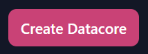
</div>

Give your Data Core a name, relevant to the data you will be assigning to it, and give a brief description of what it is.


<div style="display:flex; justify-content:center">
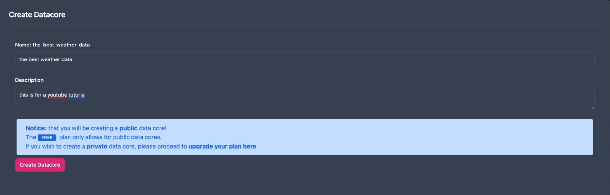 
</div>

Public Data Cores are ideal for:

- Data that you don't mind being public; such as some irrelevant test data.
- Data that you would like to be accessible to the world to utilise; such as:
  - Weather data.
  - Traffic data.
  - High-scores.
  - e.t.c.

Private Data Cores are ideal for:

- Internal Company data; such as user, or financial information
- Personal data; such as financial data, or my acne status

:::note
If you are using the **Free Tier** you will only be able to create public Data Cores. To create private Data Cores, you have to upgrade to **Pro** or higher
:::

<div style="display:flex; justify-content:center">
    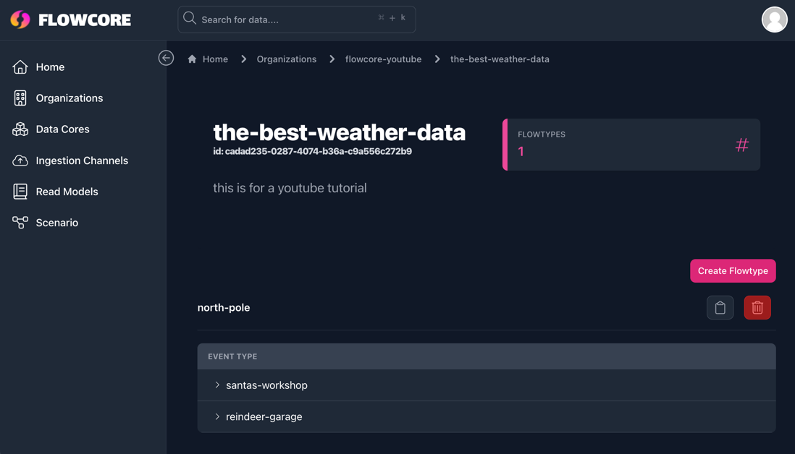
</div>

Within the Data Core, you can organize your data further by creating groups and subgroups. This is done by creating **Flowtypes** from within the Data Core.

To simplify the concept of flowtypes, you can imagine that the aggregator is a drawer and the Event Types are little storage boxes within the drawer. This gives you the ability to roughly organize your data without having to be too thorough.
Allowing you to group up multiple related data sets into one Data Core.

To create a flowtype, click the **Create Flowtype** button within your Data Core’s page. Here you will be able to define the aggregator, write a description and list your Event Types.

<div style="display:flex; justify-content:center">
    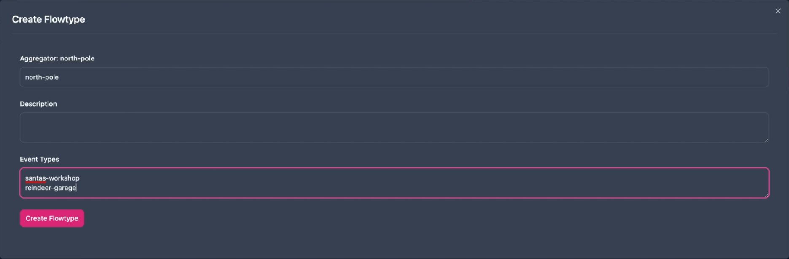
</div>

Generating the following outcome:

<div style="display:flex; justify-content:center">
    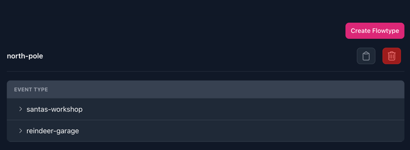
</div>


### Connecting to a Data Core

Next, we explore how to send data into a Data Core through ingestion channels. This can be found in the panel on the left-hand side.

<div style="display:flex; justify-content:center">
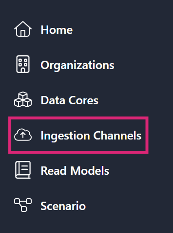 
</div>

Currently, Flowcore supports webhooks, with plans to introduce MQTT and "bring your own" custom options in the future. For this guide, we will be using webhooks, so go ahead and click **Integrate** in the Webhook panel.

<div style="display:flex; justify-content:center">
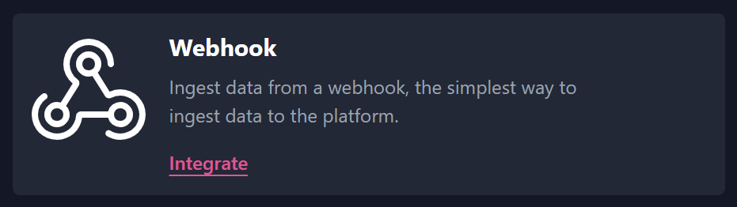 
</div>

Here you can choose which organization, Data Core, flowtype and Event Type to use. This will generate a webhook, which is a URL you can call. However, to complete the webhook, you will need to generate an API key for authentication.

<div style="display:flex; justify-content:center">
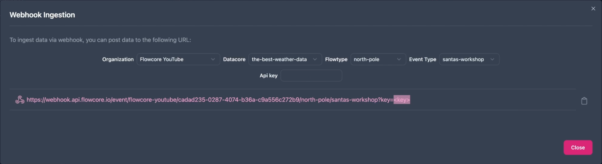 
</div>

To generate an API key, click on your user in the top right corner and select **settings**. At the bottom of your user settings’s page, is a field called **API Keys**. Simply click the **Create API Key** to generate a key.

<div style="display:flex; justify-content:center">
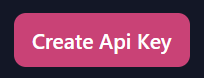 
</div>

Give the key a name, which makes sense to you and your project, and it will generate a key for you. You can copy this to your clipboard and paste it into the webhook, to complete it. 

<div style="display:flex; justify-content:center">
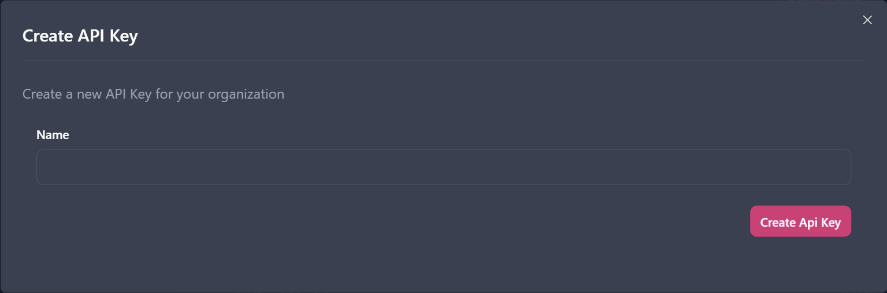 
</div>

The benefit to using these API keys is the ease to delete them at will, in case you should choose to revoke access to your Data Core. And there is less authenticative management on your part

Now return to the ingestion channel and paste the API key into the webhook URL, so it ultimately looks like this:

<div style="display:flex; justify-content:center">
    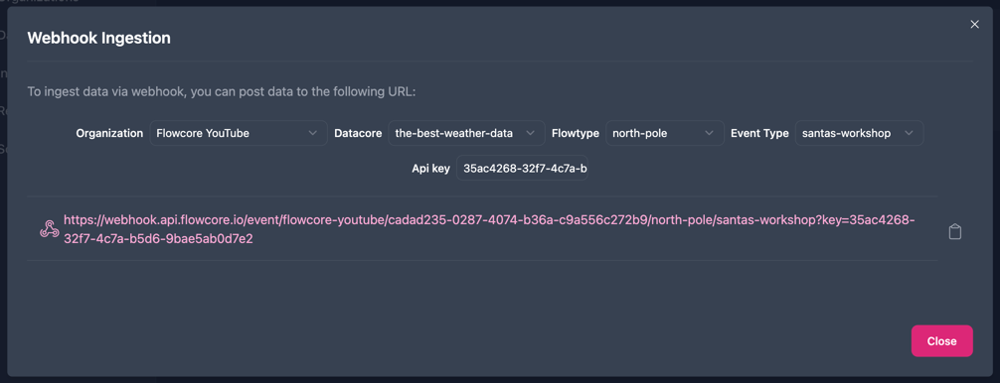
</div>

### Sending Data to a Data Core

Once the API key is generated and added to the webhook URL, it is time to send data to the Data Core. For sending the data, you can use different tools; we will be using [**Insomnia**](https://insomnia.rest/).

1. Open Insomnia
2. Create a new HTTP request and set it to `POST`
3. Paste the generated webhook into the URL field
4. *Set the body to `JSON`
5. Populate the body with the data you want to send
6. Press Send

> Note: The webhook ingestion currently only support `JSON` data, hence why we set the body to `JSON`.

<video width={"100%"} autoPlay controls loop>
    <source src="../../../../public/videos/getting-started/insomnia-data-animated.mp4" type="video/mp4"/>
    You don't have a browser that is compatible with this video.
</video>

The whole structure of the data is defined by the data you send in, so it is completely schema-less.

To send data to a different Event Type, you can either generate a new webhook as you did before, or you can manually simply the name in the webhook URL.
> **Note**: that you can reuse the api key as much as you want, but for security and flexibility we recommend generate new ones accordingly.
> Having multiple keys, gives you the option for cutting off access to specific keys, without having to revoke access to all of them.

## Creating a Read Model (with PlanetScale)

<YouTube id="https://www.youtube.com/watch?v=xB4l5pvIkTs" />

Here we will explore the concept of read models in Flowcore and learn how to connect them to external sources. Read models are vital for retrieving data from Flowcore and transferring it to your own systems, such as databases or other storage solutions.

This guide provides an introduction to read models and walks you through connecting a read model to an external source, specifically using PlanetScale to set up a database.

:::note
You wish to fully follow along this guide, then you will need an account on **[PlanetScale](https://planetscale.com/)** to create a database. Alternatively, you can consider everything in the guide related to Flowcore and utilise your own online storage of choice
:::

A read model in Flowcore serves as the gateway, to extract data from Flowcore and into your preferred external sources. The primary objective is to facilitate data transfer and integration with your own systems. We will demonstrate connecting a read model to a PlanetScale database, but Flowcore offers multiple options for various external sources.

### Creating a PlanetScale database
To get started, we need an actual database to connect to. Creating a database in PlanetScale, is as easy as clicking **Create a new database** on their website.

<video width={"100%"} autoPlay controls loop>
    <source src="../../../../public/videos/getting-started/create-a-planet-scale-database.mp4" type="video/mp4"/>
    Create a new database on PlanetScale
</video>


Where you have to do the following:
- name your database
- choose a plan that suits your project
- create the database
- create a connection

You have to name your database, choose a plan that suits your project and then create the database. PlanetScale uses MySQL, so you won’t have to select a language or framework. Once the database is done connecting, it will be ready to use.

With the external database ready, we proceed to Flowcore to set up a read model. By navigating to the lefthand side panel, select **Read Models** and then click **Create Read Model** on the righthand side.

<div style="display:flex; justify-content:center">
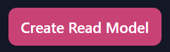 
</div>

Give your read model an appropriate name and optionally write a description for it. 

<div style="display:flex; justify-content:center">
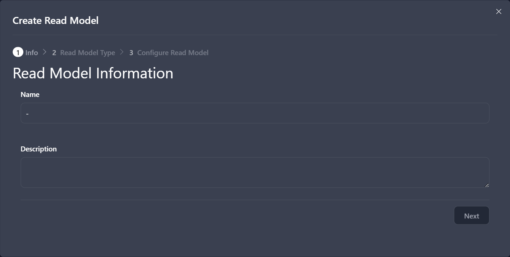 
</div>

### Connecting a Read Model to an External Database 

Flowcore supports various endpoints for external sources. For this instance, we choose the **External MySQL Read Model**. 

<div style="display:flex; justify-content:center">
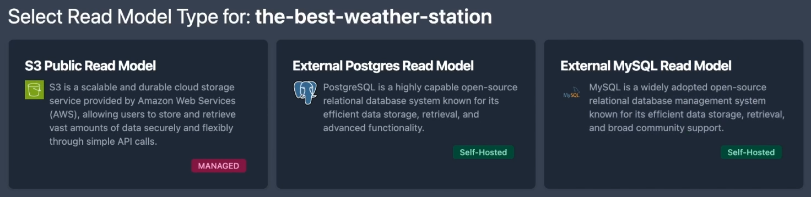 
</div>

To establish the connection to the external database, we must provide the necessary configuration details. To connect to the PlanetScale database, enter the
- database name,
- username,
- password
- leave the port as is
- host information
- select "Use SSL", and leave the CA certificate blank (specific to PlanetScale).

<div style="display:flex; justify-content:center">
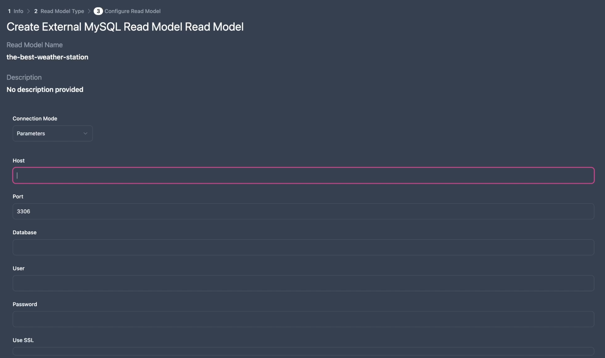 
</div>

All of this information can be found by **Connecting** to the PlanetScale database on their website. 

<div style="display:flex; justify-content:center">
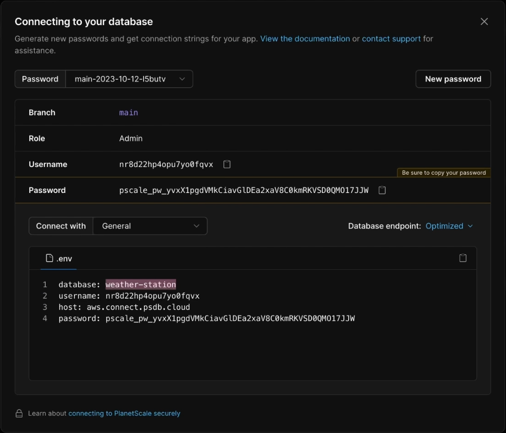
</div>
Once these details are entered, the read model is created and ready for data transfer.

## Transferring Data from a Data Core to a Read Model

<YouTube id="https://youtu.be/qiOyu9YeJCQ" />

We'll delve into the process of transferring data from a Data Core to a read model within the context of Flowcore. Flowcore simplifies the data transformation process, allowing you to seamlessly transfer data from a Data Core into an external database, such as PlanetScale.

### Connecting a database viewer to PlanetScale

<div style="display:flex; justify-content:center">
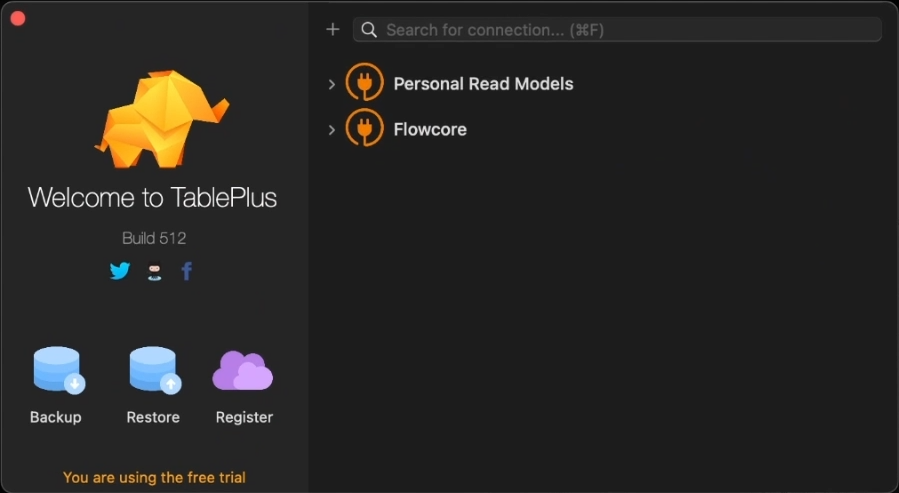
</div>

To begin, you need to establish a connection to the external database, in this case, PlanetScale. You can use any database client, like TablePlus, to set up this connection.

<div style="display:flex; justify-content:center">
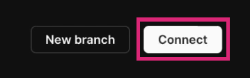
</div>

In your selected PlanetScale database, click the **Connect** button on the top right side. 

<div style="display:flex; justify-content:center">
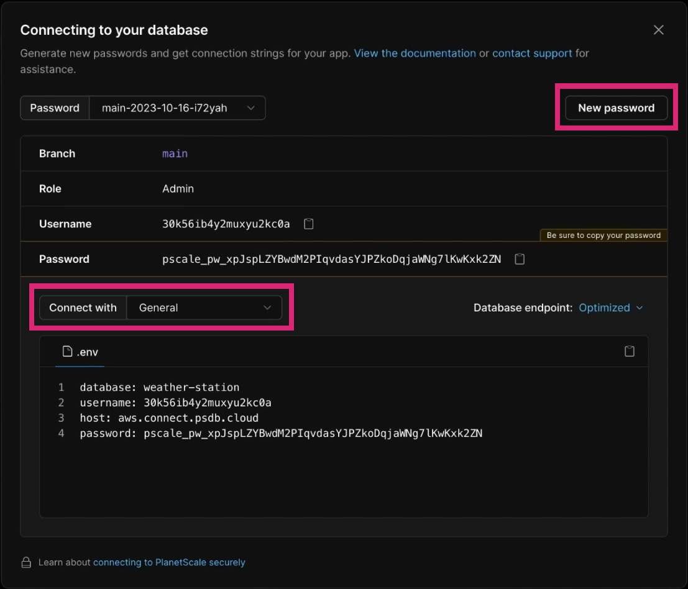
</div>

Then you create a **New password**. Ensure you select **General** to access the required database properties.

<div style="display:flex; justify-content:center">
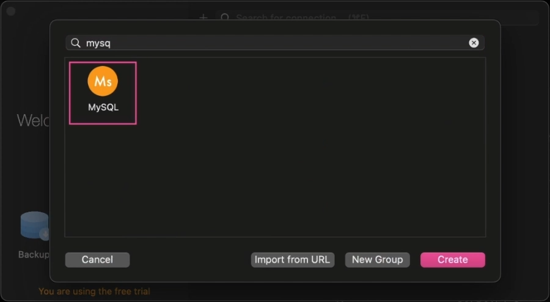
</div>

Open TablePlus and create a new MySQL connection.

<div style="display:flex; justify-content:center">
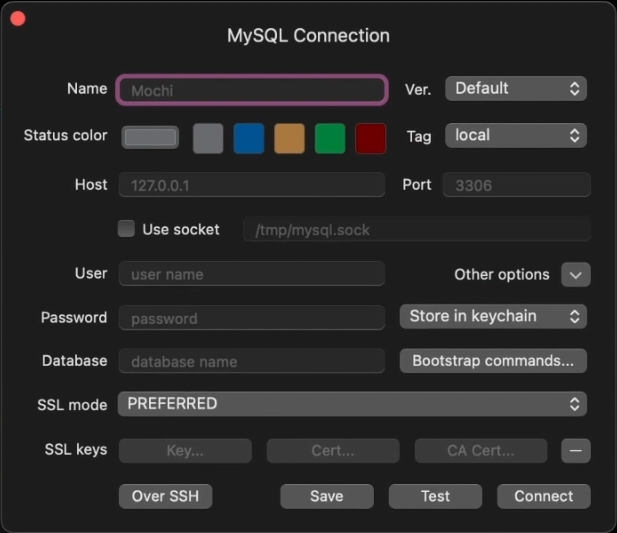
</div>

Then copy over the information from PlanetScale.

### Transferring the data to a read model

<div style="display:flex; justify-content:center">
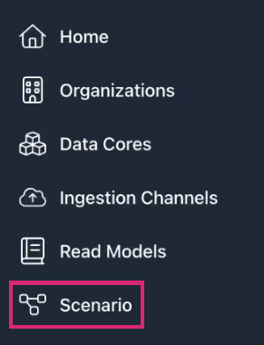
</div>

In Flowcore, the next step is to create a scenario. You can find the **Scenario** tab on the left hand side menu.

<div style="display:flex; justify-content:center">
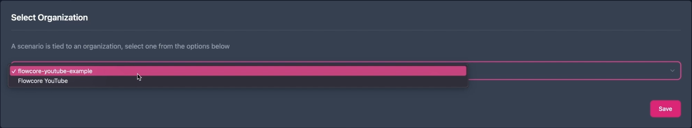
</div>

When creating a new scenario, you are asked to select an organization. This will reflect which Data Cores and read models you are able to access within your scenario. However, if you have subscribed to a public Data Core, then you are also able to select those Data Cores. 

:::tip[Subscribing to public Data Cores]
You can subscribe to a public Data Core by going to **Organizations**, choosing the organization which has the Data Core you want to subscribe to, selecting a Data Core in the **Data cores** list and simply click the **+Subscribe** button at the top of the page. 
:::

<div style="display:flex; justify-content:center">
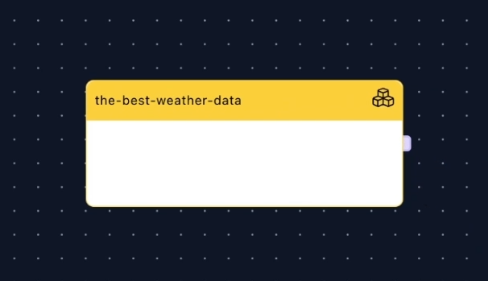
</div>

When you have chosen a Data Core, it will show up in your **Scenario**. On the right side of the Data Core node, is a small purple nub. This is the **Node Connection**. Clicking that will drag out a line to create a new node. This is how you create an adapter.

<div style="display:flex; justify-content:center">

</div>

Adapters play a crucial role in data transformation. They allow you to modify the data as it flows from the Data Core to your external database.

<div style="display:flex; justify-content:center">
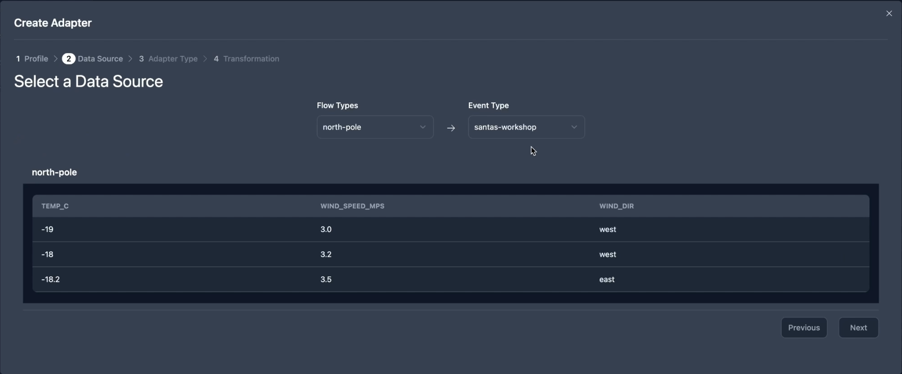
</div>

You can choose the Event Type, language (Flowcore supports various languages like TypeScript and Python, with more to come in the future), and even create custom transformations as needed. More information regarding transforming data can be found in the next section of this guide.

If you leave all the settings as they are, it will just allow the data to flow, untransformed, from the datacore to your read model.

<div style="display:flex; justify-content:center">
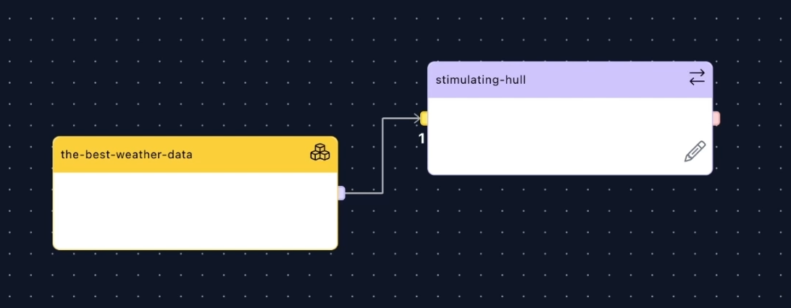
</div>

You can now create a new node from the adapter to pipe the data into another Data Core or a read model. Simply create a new **Node Connection** from your adapter node.

<div style="display:flex; justify-content:center">
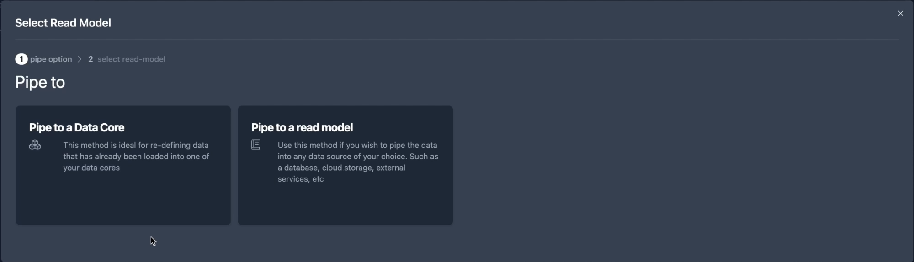
</div>

With Flowcore, you have the flexibility to transfer data to a read model or another Data Core. This is particularly useful if you need to correct or version data before moving it to the final destination. In our demonstration, we focus on the read model option, where data is pushed directly into an external database.

<div style="display:flex; justify-content:center">
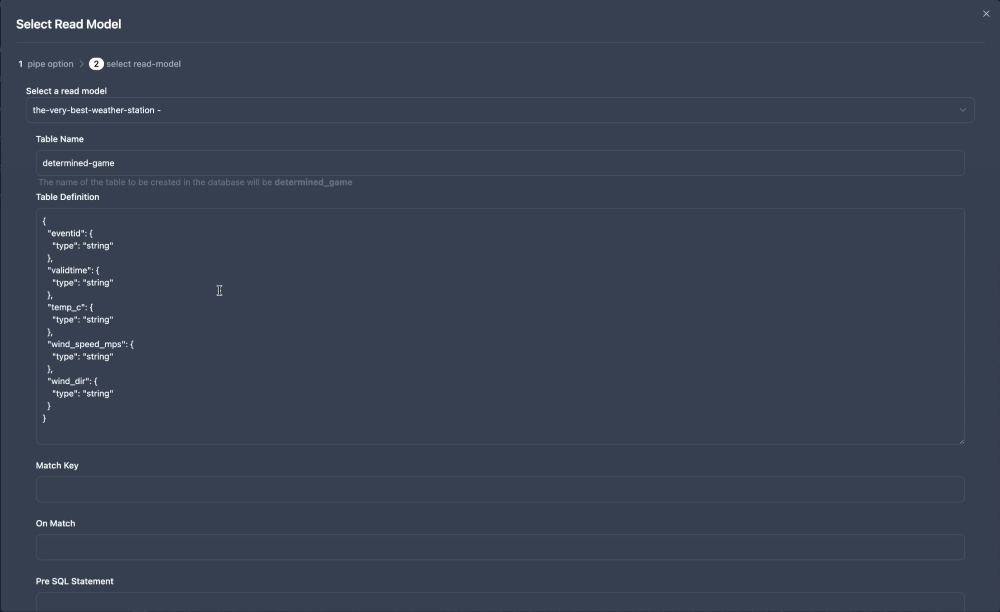
</div>

Choose the read model you would like to use for this scenario. You can change the **Table Name** and the **Table Definition** if you wish, but in this instance it isn't required.

<div style="display:flex; justify-content:center">

</div>

Press **Complete** and your scenario will be updated.

<div style="display:flex; justify-content:center">
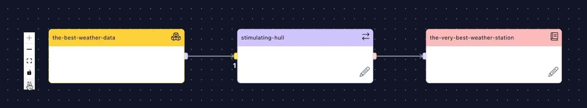
</div>

You can organize your nodes however you want or just use the alignment tool at the bottom left corner of the window. This will put all your nodes in a tidy straight line.

<div style="display:flex; justify-content:center">
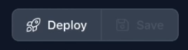
</div>

Once you've set up the scenario, defined the adapters, and configured the read model, save your work. This action is necessary before deployment to ensure changes are preserved. Deploying your configuration initiates the data transfer process. You might also want to name your scenario before deploying.

<div style="display:flex; justify-content:center">
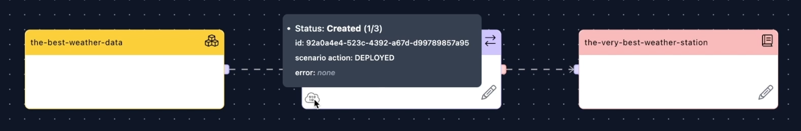
</div>

You can see the status of deployment by hovering over the little cloud icon on the bottom left corner of your adapter node. This can take a minute.

<div style="display:flex; justify-content:center">
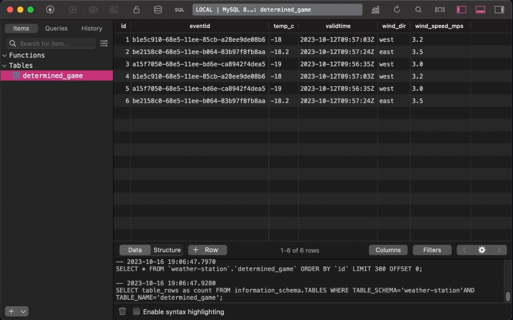
</div>

After deployment, your data will be transformed and transferred to the specified external database. You can check the database to verify that the data has been successfully transferred. Flowcore handles the entire process for you, allowing you to maintain control and flexibility.

<div style="display:flex; justify-content:center">
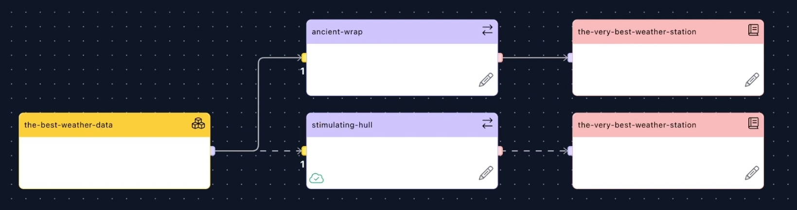
</div>

If you want to transfer data from other Event Types within your Data Core into the same read model, you can do so easily by just repeating the same process. Create a new adapter, select the other Event Type and then pipe it into the same read model, but under a different table name. Save and deploy.

<div style="display:flex; justify-content:center">
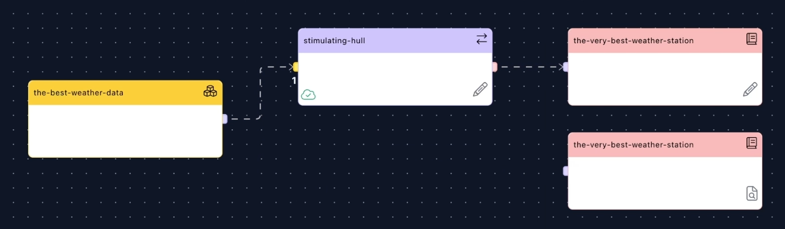
</div>

Lastly, you can also delete adapters whenever you want, in case you don't need the data from the Event Type anymore. Simply select them, delete, save and deploy. You can even recreate them later if you change your mind again.

## Transforming Data it Before Reaches the Read Model

<YouTube id="https://youtu.be/NA7EqhaJpRI" />

The objective of this section is getting data from a Data Core, put into the adapter and restructuring that data. Then we push it into the external source, which in this case is a PlanetScale database.

To begin, let's recap the previous stage, where we transferred data from a Data Core into an adapter without any modifications. This time, we will follow a different approach. We'll take data from the Data Core and pass it through an adapter, where we'll transform the data by adding additional properties to the data before exporting it into the database.

The main difference between transfering and transforming data is the steps taken within the adapter node. The Data Core and read model nodes are handled in the exact same way.

<div style="display:flex; justify-content:center">
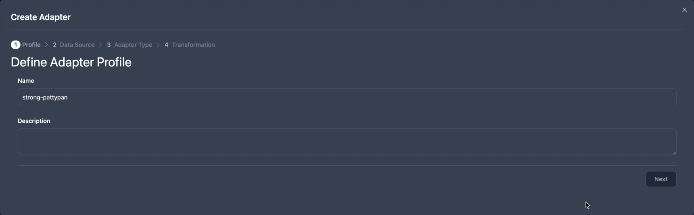
</div>

First, we need to create a new adapter node and select the relevant Event Type.

<div style="display:flex; justify-content:center">
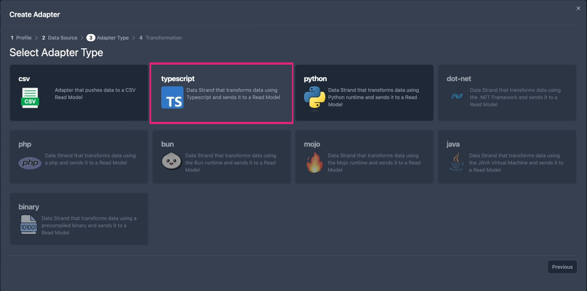
</div>

For this example we're using **typescript**, so go ahead and select that. The code will be responsible for modifying the incoming data. The structure of this code will be based on what you want to achieve, and you have full control over it.

<div style="display:flex; justify-content:center">
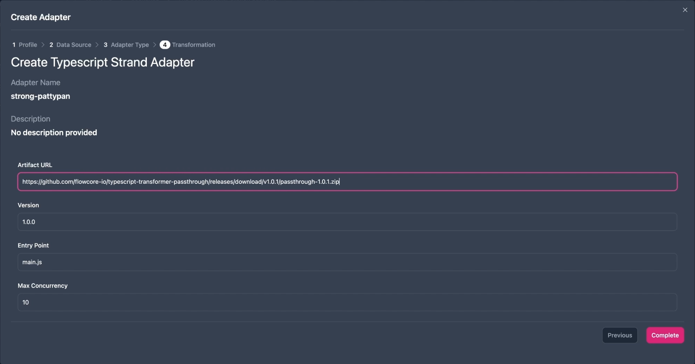
</div>

Unlike when you only have to transfer data, we will need to pay attention to the **Artifact URL** field, when transforming data. This is a URL to a package which has been generated within GitHub. We have to make a URL like this, to feed the transformation code into our adapter.

### Creating your own transformation code
Firstly, we need to go to [Flowcore's GitHub page](https://github.com/flowcore-io).

<div style="display:flex; justify-content:center">
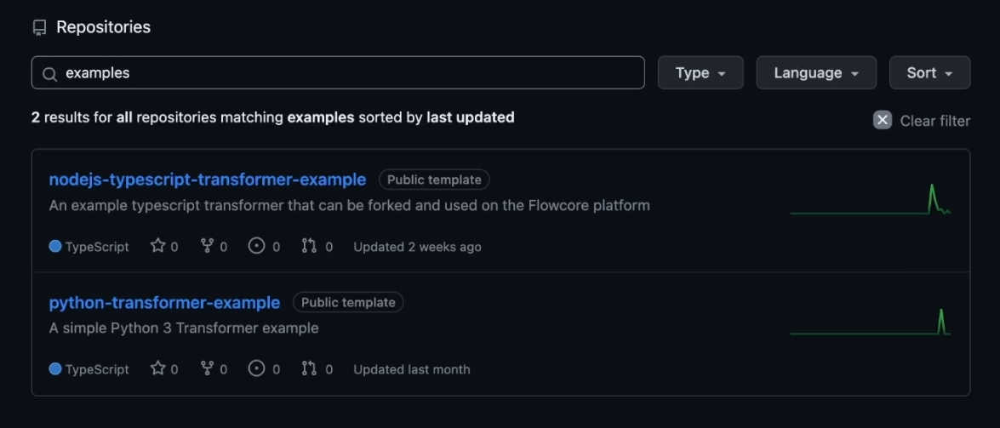
</div>

From there you can search for the available templates (such as `nodejs-typescript-transformer-example`), which you can use to get started. You can of course also make and use your own custom solution, but we will be using the examples we made for simplicity, for this guide. So go ahead and click the typescript template.

<div style="display:flex; justify-content:center">
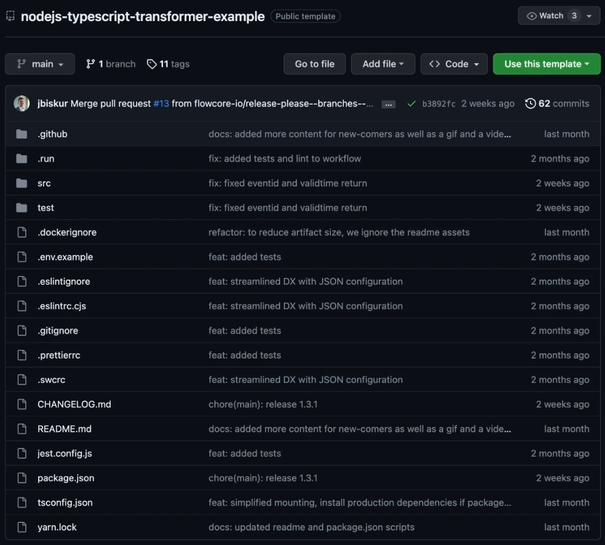
</div>

This is all boilerplate code, which we can adjust to our needs. When using this template you create your own repository. This means that all code you use will belong to you and not Flowcore. This puts you in full control of your data, trainsformations and end points.

<div style="display:flex; justify-content:center">
 
</div>

This is all boilerplate code, which we can adjust to our needs. When using this template you create your own repository. This means that all code you use will belong to you and not Flowcore. This puts you in full control of your data, transformations and endpoints. 

<div style="display:flex; justify-content:center">
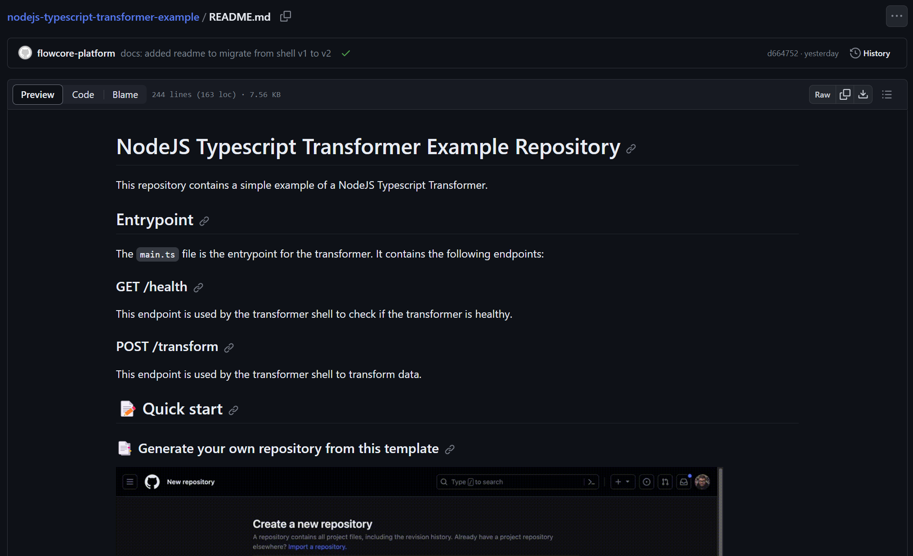
</div>

To create your own repository, you can follow this [README file](https://github.com/flowcore-io/nodejs-typescript-transformer-example/blob/main/README.md), which also has a YouTube tutorial included.

<div style="display:flex; justify-content:center">
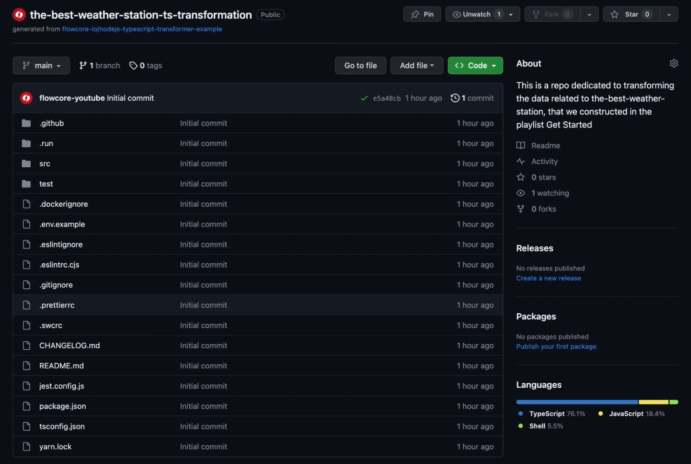
</div>


### Adjusting the transformation code
Once you've created your own repository based on the template we provided. Make sure to navigate to your repository and press the `.` key on your keyboard to open the live editor in GitHub.
Then proceed to navigate to the file `src/functions/transformer.entrypoint.ts`.

For the purpose of this guide, we will demonstrate calculating the difference between the temperature data from the Data Core and the optimal heating temperature within a building. The transformed data will include this calculated value.

So the final code in the `transformer.entrypoint.ts` file looks like this:


```typescript
// -----------------------------------------------------------------------------
// Purpose: Transform entrypoint
// this is the entrypoint that will be called when the transformer is invoked
// to transform an event, the return value of this function will be passed to
// the read model adapter.
// -----------------------------------------------------------------------------
interface Input<T = any> {
  eventId: string;
  validTime: string;
  payload: T;
}

type Payload = {
  temp_c :string;
  wind_speed_mps: string;
  wind_dir: string;
}

const OPTIMAL_HEATING_IN_TEMP = 22.0;

export default async function (input: Input<Payload>) {

  const tempInNumber = parseFloat(input.payload.temp_c);
  const distanceBetweenTemps = OPTIMAL_HEATING_IN_TEMP - tempInNumber;

  return {
    eventid: input.eventId,
    validtime: input.validTime,
    ...input.payload,
    distance_from_optimal_heating: distanceBetweenTemps
  };
}
```

What you need to take away from this code is:
- that `input` parameter passed into the function is the unstructured data from the Data Core
- the `return` value of the function is the data that is sent to the read model

Everything else in between there is just the transformation code.

### Verifying your transformation code
The template has built in unit tests, so that you can verify that your code does what you expect before releasing it.

Navigate to `test/expected.json`. This file allows you to create a quick and simple test to verify that the expected input returns the expected output.
So in our case, the `expected.json` file looks like this:
```json
[
  {
    "input": {
      "temp_c": "-19",
      "wind_speed_mps": "10",
      "wind_dir": "west"
    },
    "output": {
      "eventid": ":uuid:",
      "validtime": ":date:",
      "temp_c": "-19",
      "wind_speed_mps": "10",
      "wind_dir": "west",
      "distance_from_optimal_heating": 41
    }
  },
  {
    "input": {
      "temp_c": "2",
      "wind_speed_mps": "10",
      "wind_dir": "east"
    },
    "output": {
      "eventid": ":uuid:",
      "validtime": ":date:",
      "temp_c": "2",
      "wind_speed_mps": "10",
      "wind_dir": "east",
      "distance_from_optimal_heating": 20
    }
  }
]
```

### Generating a release
As stated in the [README file](https://github.com/flowcore-io/nodejs-typescript-transformer-example/blob/main/README.md), the template will automatically generate a pull request. Once that has been merged in, the template will start generating your release.

<div style="display:flex; justify-content:center">
    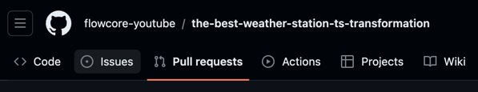
</div>

Once you've approved every automated build under **Pull requests** tab, you can go to the **Releases** on the right hand side of your github page.

<div style="display:flex; justify-content:center">
    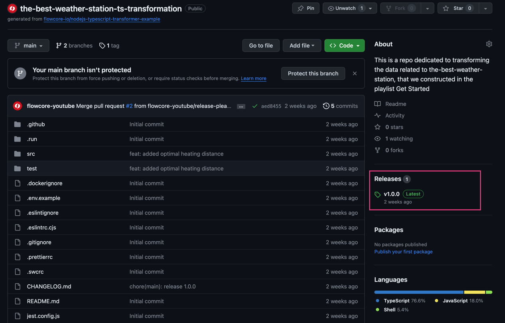
</div>

Navigate to your desired release, locate the `.zip` file, and copy the link to the file. This release serves as the point of integration with the Flowcore platform.

<div style="display:flex; justify-content:center">
    <Image src={GitHubCopyingLinkToRelease} width={"2000em"} height={"100%"} alt={"GitHub Copying Link of Release"}/>
</div>

### Connecting Adapter to GitHub Release
In Flowcore, set up an adapter by configuring the transformation execution environment, specifying the language (TypeScript, in this case).
And finally provide the **Artifact URL**, which is the link to the `.zip` file you copied from GitHub.

Complete the adapter settings.

### Adjusting the Read Model Table Definition
When connecting to a read model, it is important to note that you may need to adjust the **Table Definition** to accommodate the new data structure. In this example, we added a new field to the data, so we need to update the table definition to include this new field.
In our case the read model table definition looks like this in the end:

<div style="display:flex; justify-content:center">
    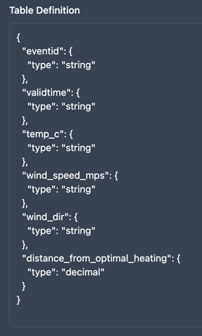
</div>

> Note that the available types are the following:
> | Type | Description |
> | --- | --- |
> | `string` | A short text, or an ID |
> | `text` | A longer text |
> | `integer` | A whole number (1,2,3,4) |
> | `decimal` | A decimal number (1.2, 123.32, 0.0122) |
> | `boolean` | A `true` or a `false` |

<br/>

The transformation code is now integrated into Flowcore, and as data flows from the Data Core through the adapter, it undergoes the defined transformation process. The transformed data is pushed into the read model, which, in this example, is a database on PlanetScale.

The flexibility of this approach allows you to iterate through the process, making changes to your transformation code or data mapping as needed to achieve the desired outcome. You can add or remove fields, adjust calculations, or even incorporate external data sources into the transformation process.

By following these steps, you can effectively transform data within Flowcore before it reaches the read model, ensuring that it's structured and enriched according to your specific requirements.
