import { YouTube } from '@astro-community/astro-embed-youtube';
import { Card } from '@astrojs/starlight/components';

This guide is your starting point for using the Flowcore platform. Whether you're a beginner or an experienced user, it provides insights and tips to help you navigate Flowcore with confidence and make the most of its versatile features.

    

## Creating an Organization

<YouTube id="https://www.youtube.com/watch?v=5k8OJvOTQ9k" />

Here we will explore how organizations function within the Flowcore platform and how to set up your own organization.

:::note
		**Flowcore is an evolving platform, so keep in mind that certain features may change in the future.** 
:::

**Organizations on Flowcore are publicly accessible**, and users can browse existing organizations to learn more about them, including their:
- Descriptions
- Websites
- Contributors
- and any publicly available data they offer. To get started, you need to log in to Flowcore.

### Login / Creating an account

To log in, go to **www.flowcore.io** and navigate to the top right corner.

     

Log in using your GitHub account credentials.

<Card title="GitHub" icon="github">
    **If you don't have a GitHub account, you can [click here](/https://docs.github.com/en/get-started/onboarding/getting-started-with-your-github-account/)  if you need a guide on how to set one up.**
</Card>

If you are logging in for the first time, you may encounter a setup page - just leave it do its thing, and press continue once it is done; it is simply there to configure your new account.

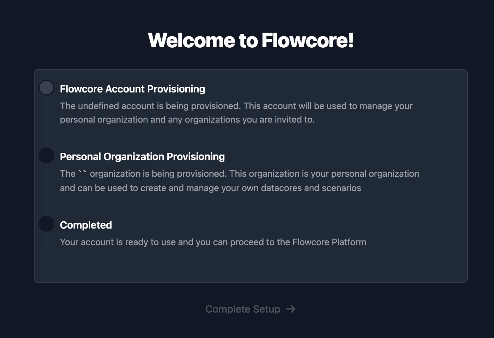 

After you've logged in, you should see the flowcore dashboard:

    

### Updating your organization

Once logged in, you can navigate to your organizations on the panel on the left-hand side of the page.

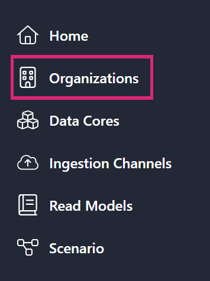 

Here you will be shown a collection of your organizations, as well as other organizations on the platform. Select your organization:

    

    

From here you can customize your organization, by pressing the **Settings** button, allowing you to:
- Set the display name of your organization.
- Provide a brief description of its purpose. 
- Add a link to a website. 

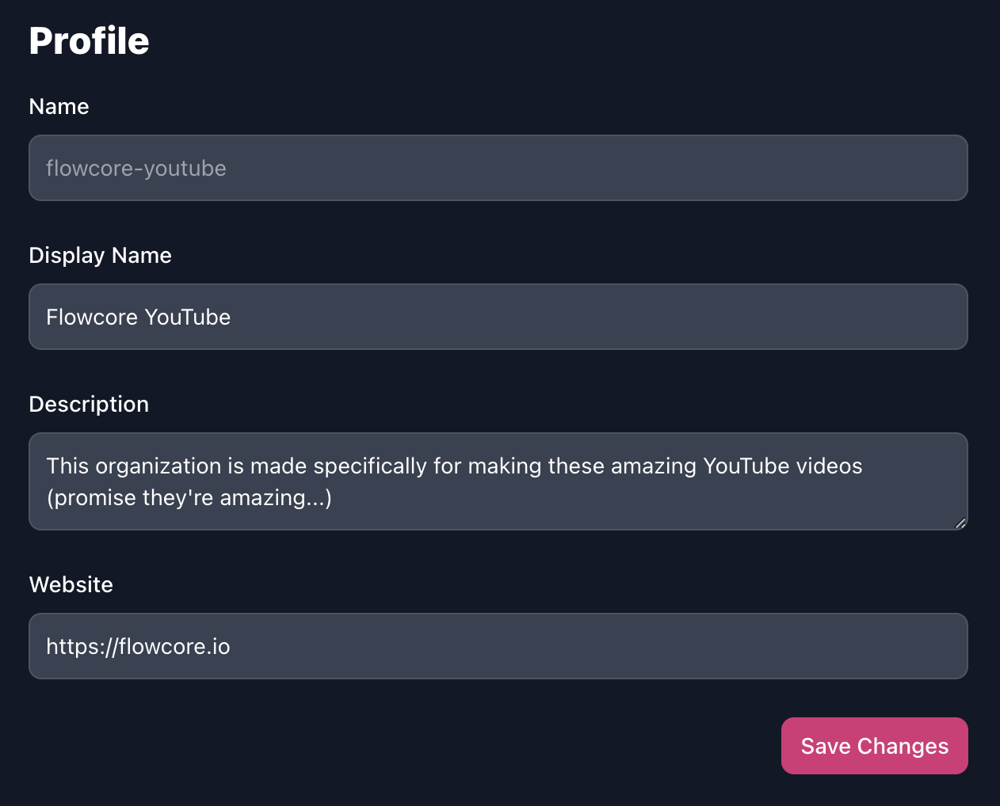 

### Pricing

Flowcore offers different tiers of service, with varying features and pricing. These plans include:

- **Free Tier:** Suitable for solo users or researchers, who want to explore and share public data.
- **Pro Tier:** Geared towards solo users or companies, providing private data cores for exclusive data access.
- **Team Tier:** Ideal for collaborative teams, allowing multiple contributors to participate.
- **Custom Tier:** Tailored for large organizations, offering dedicated support and resources.

 

Plans can be billed on a **yearly** or **monthly** basis, depending on your preference. 

You can always change your plan by clicking the **Upgrade** button on the bottom right of your organization's page.

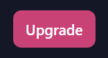 

By default, when you first log into the Flowcore platform, your organization will be assigned the **Free Tier**. You can choose to upgrade at any point.

### Creating Additional Organizations

It is important to understand the relationship between users and organizations on Flowcore. When you log in, a personal organization is created that matches your username. Your personal organization typically utilises the free or pro tier, for your own personal projects and/or test use cases.

If you want to establish a separate organization for a specific project or team, you can easily create one - **when you create a second organization, you are automatically added to that organization as a collaborator, with the role of *Owner*.**

To create a new organization, simply navigate back to the list of organizations and press the **New Organization** button in the top right corner.

 

## Creating a Data Core

<YouTube id="https://www.youtube.com/watch?v=IdPruN6Zyic" />

Here we will provide an overview of data cores, explaining how they function and guiding you through the process of creating them. Additionally, we'll explore how to load data into these data cores using webhooks.

A data core in Flowcore is essentially a container for unstructured data. You have the flexibility to send in any dataset you desire, and it doesn't need to be predefined. This approach is incredibly useful for scenarios where you have vast amounts of data, and you're uncertain about what specific pieces you'll need. You can load it all into the data core and decide later which data is relevant to your needs.

To create a data core, navigate to your organization and press the **Create Datacore** button, located on the right-hand side.

    

    

Give your data core a name, relevant to the data you will be assigning to it, and give a brief description of what it is.

 

Public data cores are ideal for:

- Data that you don't mind being public; such as some irrelevant test data.
- Data that you would like to be accessible to the world to utilise; such as:
  - Weather data.
  - Traffic data.
  - High-scores.
  - e.t.c.

Private data cores are ideal for:

- Internal Company data; such as user, or financial information
- Personal data; such as financial data, or my acne status

:::note
If you are using the **Free Tier** you will only be able to create public data cores. To create private data cores, you have to upgrade to **Pro** or higher
:::

    

Within the data core, you can organize your data further by creating groups and subgroups. This is done by creating **Flowtypes** from within the data core.

To simplify the concept of flowtypes, you can imagine that the aggregator is a drawer and the event types are little storage boxes within the drawer. This gives you the ability to roughly organize your data without having to be too thorough.
Allowing you to group up multiple related data sets into one data core.

To create a flowtype, click the **Create Flowtype** button within your data core’s page. Here you will be able to define the aggregator, write a description and list your event types.

    

Generating the following outcome:

    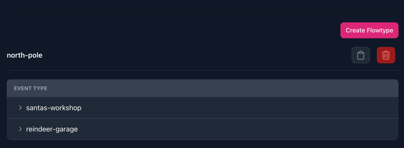

### Connecting to a Data Core

Next, we explore how to send data into a data core through ingestion channels. This can be found in the panel on the left-hand side.

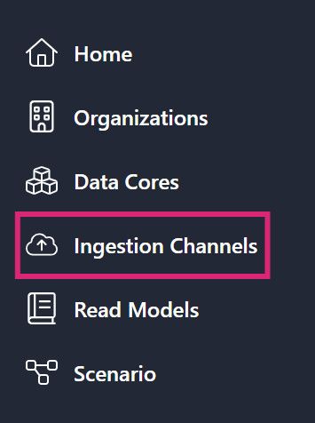 

Currently, Flowcore supports webhooks, with plans to introduce MQTT and "bring your own" custom options in the future. For this guide, we will be using webhooks, so go ahead and click **Integrate** in the Webhook panel.

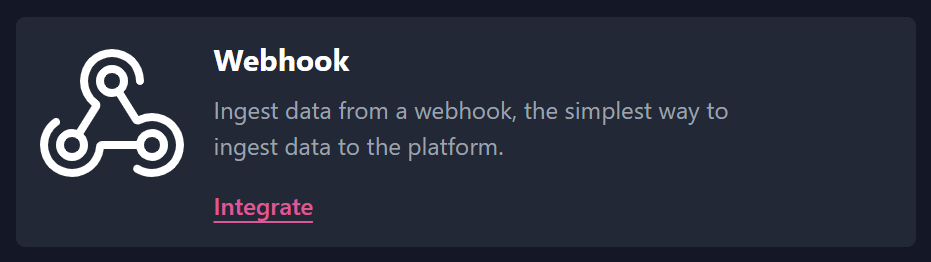 

Here you can choose which organization, data core, flowtype and event type to use. This will generate a webhook, which is a URL you can call. However, to complete the webhook, you will need to generate an API key for authentication.

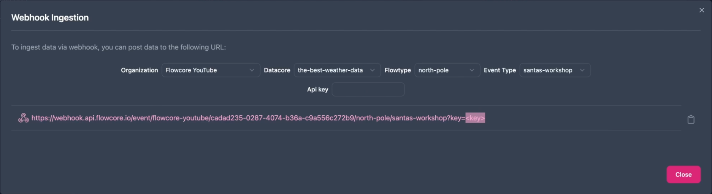 

To generate an API key, click on your user in the top right corner and select **settings**. At the bottom of your user settings’s page, is a field called **API Keys**. Simply click the **Create API Key** to generate a key.

 

Give the key a name, which makes sense to you and your project, and it will generate a key for you. You can copy this to your clipboard and paste it into the webhook, to complete it. 

 

The benefit to using these API keys is the ease to delete them at will, in case you should choose to revoke access to your data core. And there is less authenticative management on your part

Now return to the ingestion channel and paste the API key into the webhook URL, so it ultimately looks like this:

    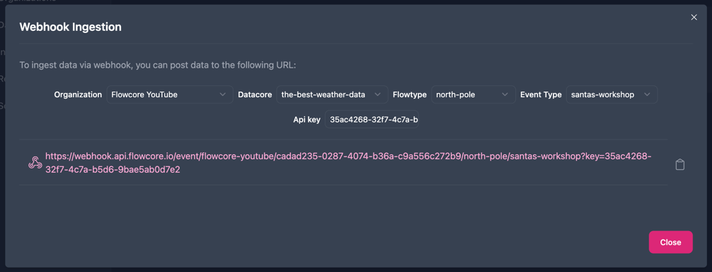

### Sending Data to a Data Core 

Once the API key is generated and added to the webhook URL, it is time to send data to the data core. For sending the data, you can use different tools; we will be using [**Insomnia**](https://insomnia.rest/).

1. Open Insomnia
2. Create a new HTTP request and set it to `POST`
3. Paste the generated webhook into the URL field
4. *Set the body to `JSON`
5. Populate the body with the data you want to send
6. Press Send

> Note: The webhook ingestion currently only support `JSON` data, hence why we set the body to `JSON`.

<video width={"100%"} autoPlay controls loop>
    <source src="../../../../public/videos/getting-started/insomnia-data-animated.mp4" type="video/mp4"/>
    You don't have a browser that is compatible with this video.
</video>

The whole structure of the data is defined by the data you send in, so it is completely schema-less.

To send data to a different event type, you can either generate a new webhook as you did before, or you can manually simply the name in the webhook URL.
> **Note**: that you can reuse the api key as much as you want, but for security and flexibility we recommend generate new ones accordingly.
> Having multiple keys, gives you the option for cutting off access to specific keys, without having to revoke access to all of them.

## Creating a Read Model (with PlanetScale)

<YouTube id="https://www.youtube.com/watch?v=xB4l5pvIkTs" />

Here we will explore the concept of read models in Flowcore and learn how to connect them to external sources. Read models are vital for retrieving data from Flowcore and transferring it to your own systems, such as databases or other storage solutions.

This guide provides an introduction to read models and walks you through connecting a read model to an external source, specifically using PlanetScale to set up a database.

:::note
You wish to fully follow along this guide, then you will need an account on **[PlanetScale](https://planetscale.com/)** to create a database. Alternatively, you can consider everything in the guide related to Flowcore and utilise your own online storage of choice
:::

A read model in Flowcore serves as the gateway, to extract data from Flowcore and into your preferred external sources. The primary objective is to facilitate data transfer and integration with your own systems. We will demonstrate connecting a read model to a PlanetScale database, but Flowcore offers multiple options for various external sources.

### Creating a PlanetScale database
To get started, we need an actual database to connect to. Creating a database in PlanetScale, is as easy as clicking **Create a new database** on their website.

<video width={"100%"} autoPlay controls loop>
    <source src="../../../../public/videos/getting-started/create-a-planet-scale-database.mp4" type="video/mp4"/>
    Create a new database on PlanetScale
</video>

Where you have to do the following:
- name your database
- choose a plan that suits your project
- create the database
- create a connection

You have to name your database, choose a plan that suits your project and then create the database. PlanetScale uses MySQL, so you won’t have to select a language or framework. Once the database is done connecting, it will be ready to use.

With the external database ready, we proceed to Flowcore to set up a read model. By navigating to the lefthand side panel, select **Read Models** and then click **Create Read Model** on the righthand side.

 

Give your read model an appropriate name and optionally write a description for it. 

 

### Connecting a Read Model to an External Database 

Flowcore supports various endpoints for external sources. For this instance, we choose the **External MySQL Read Model**. 

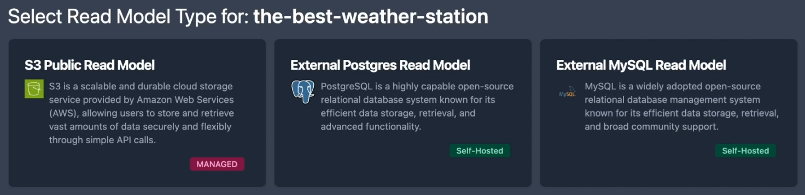 

To establish the connection to the external database, we must provide the necessary configuration details. To connect to the PlanetScale database, enter the
- database name,
- username,
- password
- leave the port as is
- host information
- select "Use SSL", and leave the CA certificate blank (specific to PlanetScale).

 

All of this information can be found by **Connecting** to the PlanetScale database on their website. 

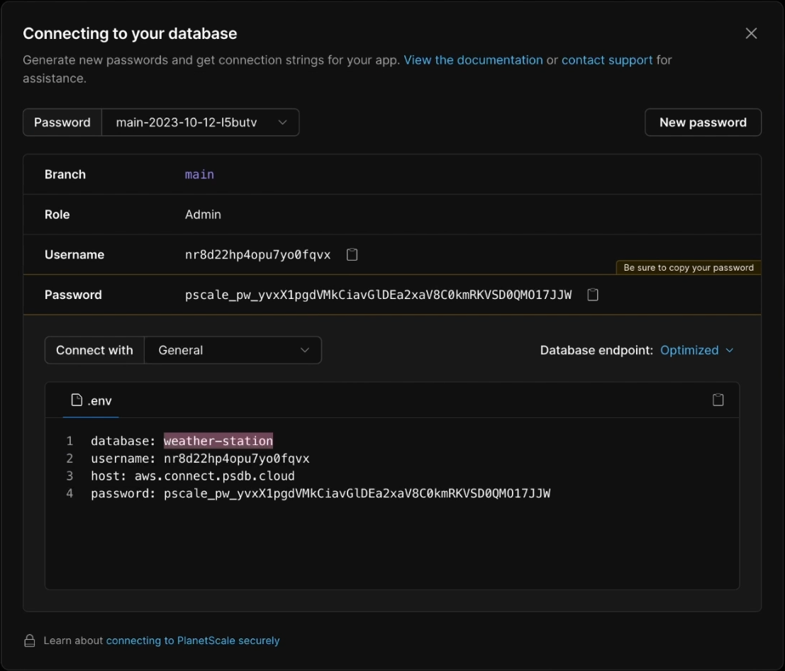

Once these details are entered, the read model is created and ready for data transfer.

## Transferring Data from a Data Core to a Read Model

## Transforming the Data Before Reaching the Read Model

