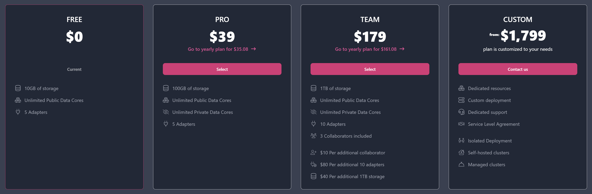

import { YouTube } from '@astro-community/astro-embed-youtube';
import { Card, CardGrid } from '@astrojs/starlight/components';

This guide is your starting point for using the Flowcore platform. Whether you're a beginner or an experienced user, it provides insights and tips to help you navigate Flowcore with confidence and make the most of its versatile features.

## Creating an Organization

<YouTube id="https://www.youtube.com/watch?v=5k8OJvOTQ9k" />

Here we will explore how organizations function within the Flowcore platform and how to set up your own organization.

:::note
		**Flowcore is an evolving platform, so keep in mind that certain features may change in the future.** 
:::

Organizations on Flowcore are publicly accessible, and users can browse existing organizations to learn more about them, including their descriptions, websites, contributors, and any publicly available data they offer. To get started, you need to log in to Flowcore.

To log in, go to **www.flowcore.io** and navigate to the top right corner.  

     

Log in using your GitHub account credentials.

<Card title="GitHub" icon="github">
    **If you don't have a GitHub account, you can [click here](/https://docs.github.com/en/get-started/onboarding/getting-started-with-your-github-account/)  if you need a guide on how to set one up.**
</Card>

If you are logging in for the first time, you may encounter a setup page - just leave it do its thing, and press continue once it is done; it is simply there to configure your new account.

Once logged in, you can manage your organization by:
- Setting the display name of your organization. 
- Provide a brief description of its purpose. 
- Add link to a website. 

Flowcore offers different tiers with varying features and pricing. These plans include:

- **Free Tier:** Suitable for solo developers or researchers who want to explore and share public data.
- **Pro Tier:** Geared towards companies, providing private data cores for exclusive data access.
- **Team Tier:** Ideal for collaborative teams, allowing multiple contributors to participate.
- **Custom Tier:** Tailored for large organizations, offering dedicated support and resources.

 

Plans can be billed on a **yearly or monthly** basis, depending on your preference. 

It is important to understand the relationship between users and organizations on Flowcore. When you log in, a personal organization is created that matches your username. Your personal organization typically utilises the free or pro tier, for your own personal projects and/or test use cases.
If you want to establish a separate organization for a specific project or team, you can easily create one - when you create a second organization, you are automatically added to that organization as a collaborator, with the role of *Owner*.

## Creating a data core

### Connecting to a data core

### Sending data to a data core 

## Creating a read model

### Connecting a read model to an external database 

## Transferring data from a data core to a read model

## Transforming the data before reaching the read model

